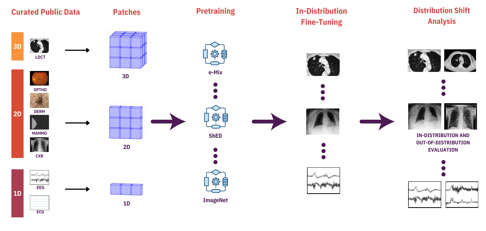
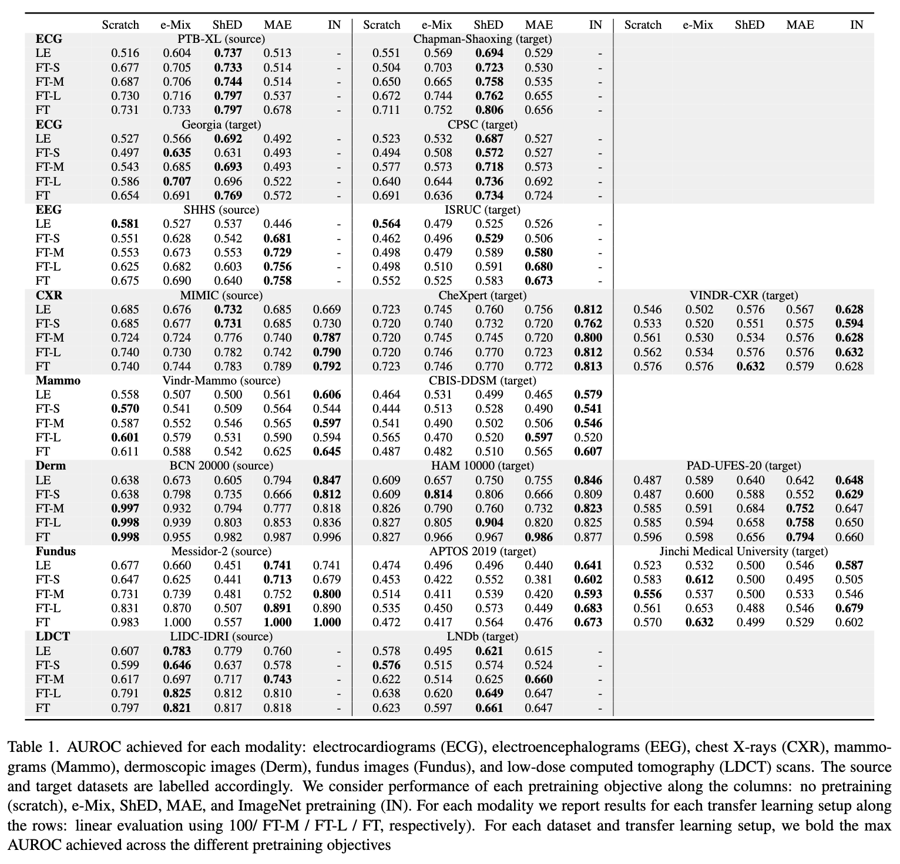

# BenchMD: A Benchmark for Modality-Agnostic Learning on Medical Images and Sensors

This repository contains the code for BenchMD, a benchmark for modality-agnostic self-supervised learning on medical image and sensor data. The BenchMD benchmark consists of 19 real-world medical datasets across 7 medical modalities. Models for each modality are first trained on a source dataset, and successful models will achieve high performance when evaluated on out-of-distribution target datasets in the same modality.



The basic components of the benchmark can be found in [datasets](#datasets), [encoders](#encoders), and [algorithms](#pretraining-algorithms). Training is implemented with the [PyTorch Lightning](https://www.pytorchlightning.ai/) framework, logging with [Weights and Biases](https://wandb.ai/), and configuration management with [Hydra](https://hydra.cc/).

BenchMD was built using the [codebase](https://github.com/alextamkin/dabs/) for DABS: A Domain Agnostic Benchmark for Self-Supervised Learning ([DABS](https://arxiv.org/abs/2111.12062), [DABS 2.0](https://openreview.net/pdf?id=ChWf1E43l4)).

<!-- TOC -->
- [Usage](#usage)
- [Datasets](#datasets)
    - [Adding New Datasets](#adding-new-datasets)
- [Encoders](#encoders)
    - [Adding new encoders](#adding-new-encoders)
- [Pretraining algorithms](#pretraining-algorithms)
    - [Adding new pretraining algorithms](#adding-new-pretraining-algorithms)
- [Pretraining Phase](#pretraining-phase)
- [Transfer Learning Phase](#transfer-learning-phase)
- [Results](#results)
- [Bugs or Questions](#bugs-or-questions)
- [Citation](#citation)

<!-- /TOC -->

## Usage
We provide support for Python >= 3.7. Install requirements with
```bash
python -m pip install -r requirements.txt
```
For instructions on how to install PyTorch versions compatible with your CUDA versions, see [pytorch.org](https://pytorch.org/).

## Datasets

We provide a set of dataset implementations (in `src/datasets`) from Electrocardiograms (ECG), Electroencephalograms (EEG), Chest X-Rays (CXR), Dermascopic Images (Derm), Mammograms (Mammo), Fundus Images (Fundus), and Low Dose Computed Tomography (LDCT). Preprocessing operations on these datasets are minimal and hard-coded as simple resizing (i.e. of images), truncations (i.e. of signal data), or windowing (i.e. of 3D CT data). These should not be changed so as to maintain fair comparisons across other users of the benchmark.

> See `conf/dataset/*.yaml` for all dataset configs, including the loss, metrics, and batch size used for each dataset. The ``name`` field in each dataset YAML file will be passed in under the ``dataset`` argument when you run pretraining or transfer. 


|Modality  | Source Dataset | Target Dataset(s) |Label type (unused)   | Input Type    |
|:-----------------|:-----------------|:-----------------|:-----------------|:-----------------:|
| ECG              | [PTB-XL](https://physionet.org/content/ptb-xl/1.0.3/) | [Chapman-Shaoxing](https://www.nature.com/articles/s41598-020-59821-7), [Georgia](https://www.kaggle.com/datasets/bjoernjostein/georgia-12lead-ecg-challenge-database), [CPSC](https://www-ncbi-nlm-nih-gov.ezp-prod1.hul.harvard.edu/pmc/articles/PMC8017170/)|Single label | 1d            |
| EEG              | [SHHS](https://sleepdata.org/datasets/shhs) | [ISRUC](https://sleeptight.isr.uc.pt/) |Single label | 1d            |
| CXR              | [MIMIC-CXR](https://cocodataset.org/#home) | [CheXpert](https://stanfordmlgroup.github.io/competitions/chexpert/), [VinDr-CXR](https://vindr.ai/datasets/cxr)|Multi label  | 2d            |
| Mammo            | [VinDr-Mammo](https://blog.einstein.ai/the-wikitext-long-term-dependency-language-modeling-dataset/) | [CBIS-DDSM](https://wiki.cancerimagingarchive.net/pages/viewpage.action?pageId=22516629) |Single label | 2d            |
| Derm             | [BCN 20000](https://huggingface.co/datasets/mc4) | [HAM 10000](https://www-ncbi-nlm-nih-gov.ezp-prod1.hul.harvard.edu/pmc/articles/PMC6091241/), [PAD-UFES-20](https://www-sciencedirect-com.ezp-prod1.hul.harvard.edu/science/article/pii/S235234092031115X)|Single label | 2d            |
| Fundus           | [Messidor-2](https://stanfordmlgroup.github.io/competitions/chexpert/) | [APTOS 2019](https://www.kaggle.com/competitions/aptos2019-blindness-detection/rules), [Jinchi](https://www.ncbi.nlm.nih.gov/pmc/articles/PMC5480986/) |Single label | 2d            |
| LDCT             | [LIDC-IDRI](https://www.ncbi.nlm.nih.gov/pmc/articles/PMC3041807/) | [LNDb](https://lndb.grand-challenge.org/Data/) |Multi label  | 3d            |

> All information for downloading datasets, as well as label distributions and label mappings (where applicable) are provided in [dataset-info.md](dataset-info.md).

### Adding New Datasets

1. Add a new Python file for preprocessing under the ``data_root`` directory (as specified in ``conf/pretrain.yaml`` and ``conf/transfer.yaml``). One of the available preprocessing files can be used as template, and we recommend using one with a matching input type (1D, 2D, or 3D). 

2. Add a corresponding configuration file under ``conf/dataset``, filling in at least all fields we have provided. The ``name`` argument will be used elsewhere in the repo and when you run training with this dataset.

3. In``data_root/catalog.py``, import the dataset Python file and add the dataset ``name`` argument wherever applicable, depending on whether it will be used for pretraining and/or transfer, whether it is labelled, etc.

## Encoders
A domain-agnostic SSL method should have an encoder which remains as constant as possible across domains. In `src/encoders`, we provide a general domain-agnostic transformer encoder baseline, as well as an ImageNet-pretrained Vision Transformer (ViT-T). The transformer operates on a sequence of vectors that are produced by a small set of embedding modules (e.g. patch or token embeddings). Each dataset and encoder has its own config file (see [conf/dataset](conf/dataset/) and [conf/model](conf/model) directories). 

> See `conf/model/*.yaml` for all model configs, including the embedding dimension, pooling method, depth, and dropout used for each encoder type.

### Adding New Encoders

1. Add a new Python class for the algorithm under ``src/models``. The new class must inherit from the the ``BaseModel`` class in ``src/models/base_model.py``.

2. Add a corresponding configuration file under ``conf/model``, filling in at least the ``name`` argument, which will be used elsewhere in the repo and when you run training with this encoder.

3. Add corresponding logic for instantating this model class using its ``name`` under ``src/systems/base_system`` in the ``get_model`` method. 


## Pretraining algorithms
The pretraining algorithm is the framework and objective that the encoder is trained with. Examples of domain-specific algorithms include [SimCLR](https://arxiv.org/abs/2002.05709), [BYOL](https://arxiv.org/abs/2006.07733), and [MoCo](https://arxiv.org/abs/1911.05722), but these are not domain-agnostic methods as they depend on vision-specific augmentations. We provide domain-agnostic implementations of recent algorithms, including *e*-mix (a generalization of [*i*-mix](https://arxiv.org/abs/2010.08887)), Shuffled Embedding Detection (ShED; a generalization of [ELECTRA](https://arxiv.org/abs/2003.10555)), which randomly permutes a subset of the input embeddings and trains the model to identify the permuted embeddings, and Masked Autoencoders ([MAE](https://arxiv.org/abs/2111.06377)), which masks a subset of input embeddings and trains models to reconstruct them.

### Adding New Pretraining Algorithms

1. Add a new Python file for the algorithm under ``src/systems``. The new class must inherit from the the ``BaseSystem`` class in ``src/systems/base_system.py``.

2. Add corresponding logic for it under ``pretrain.py``.

## Pretraining Phase
During the pretraining phase, self-supervised encoders are trained to learn good representations from unlabeled data. We currently support seven datasets for pretraining, one for each modality: PTB-XL, SHHS, MIMIC, VinDr-Mammo, BCN 20000, Messidor-2, and LIDC-IDRI. Since the pretraining datasets have associated labels, online linear evaluators are jointly trained with the encoders to provide heuristics of transfer performance. 

Run pretraining with commands like
```bash
python pretrain.py exp.name=<experiment-name> dataset=<dataset> algorithm=<algorithm> model=<encoder-type>
```

**Key Configuration Fields**
* `exp.name`: The directory under which checkpoints and other files will be saved, under ``exp.base_dir``. Must be specified each time, no default.
* `dataset`: Options include ``ptb-xl``, ``sshs``, ``mimic-cxr``, ``vindr-mammo``, ``isic2019``, ``messidor2``, and ``lidc``. Default is ``mimic-cxr``.
* `algorithm`: Options include ``emix``, ``shed``, ``mae``. Default is ``emix``.
* `model`: Encoder model to use for training. Options include ``transformer`` and ``imagenet-vit`` (the domain-agnostic Transformer and ImageNet-pretrained ViT-T, respectively). Default is ``transformer``.

 > See [pretrain.yaml](conf/pretrain.yaml) for all pretraining configuration fields.

For example, to train a domain-agnostic Transformer on the PTB-XL dataset with the *e*-Mix algorithm, run
```bash
python pretrain.py exp.name=emix-ptbxl encoder=transformer dataset=ptbxl algorithm=emix
```

## Transfer Learning Phase
After pretraining, a small linear classifier is trained on top of the frozen encoder. Run transfer learning from a randomly initialized encoder with
```bash
python transfer.py exp.name=<experiment-name> dataset=<dataset> model=<encoder-type> finetune_size=<null-or-sml> ckpt=null test=<t-or-f> 
```
**Key Configuration Fields**
* `exp.name`: The directory under which checkpoints and other files will be saved, under ``exp.base_dir``. Must be specified each time, no default.
* `dataset`: Transfer learning options are the same source datasetsas pretraining: ``ptb-xl``, ``sshs``, ``mimic-cxr``, ``vindr-mammo``, ``isic2019``, ``messidor2``, and ``lidc``. Options for testing on target datasets (see below) include ``ga``, ``chapman``, ``cpsc``, ``isruc``, ``chexpert``, ``vindr-cxr``, ``cbis``, ``isic2018``, ``aptos``, ``jinchi``, ``lndb``. Default is ``chexpert``.
* `model`: Encoder model to use for training. Options include ``transformer`` and ``imagenet-vit`` (the domain-agnostic Transformer and ImageNet-pretrained ViT-T, respectively). Default is ``transformer``.
* `finetune_size`: Options include ``null``, ``small``, ``medium``, ``large``, or ``full``. Default is ``null``, which corresponds to performing linear evaluation. If you'd like to perform finetuning, set ``finetune_size`` to be one of ``small`` (8 labels/class), ``medium`` (64 labels/class), ``large`` (256 labels/class), or ``full`` (all labels). This will allow the encoder's weights to be trained alongside the linear classifier. 
* `ckpt`: Path to file for model to beginning transfer learning from. Default `null`, which corresponds to performing transfer learning on a randomly initialized model.
* `test`: Either ``true`` or ``false``. Default is ``false``, which corresponds to performing transfer learning. The ``true`` option will freeze the model provided via the `ckpt` argument and evaluate it on the ``dataset``. 

 > See [transfer.yaml](conf/transfer.yaml) for all transfer learning configuration fields.

For example, to perform finetuning with a "small" label set on the E-Mix model we pretrained above, run

```bash
python transfer.py exp.name=finetune-small-ptbxl-emix dataset=ptbxl finetune_size=small ckpt=<path-to-pretrain-ckpt> 
```

To evaluate this model on the CPSC dataset, run 

```bash
python transfer.py exp.name=test-finetune-small-ptbxl-emix dataset=cpsc ckpt=<path-to-transfer-ckpt> test=True
```

> See `conf/transfer.yaml` for all transfer learning configuration fields

## Results




## Bugs or questions?
Feel free to email Kathryn Wantlin (kw2960@princeton.edu) or open an issue in this repo with any questions related to the code or our paper, and also to let us know if you have updated results!

## Citation

If you are using BenchMD, or are using our code in your research, please cite our paper:
>@misc{wantlin2023benchmd,
      title={BenchMD: A Benchmark for Modality-Agnostic Learning on Medical Images and Sensors}, 
      author={Kathryn Wantlin and Chenwei Wu and Shih-Cheng Huang and Oishi Banerjee and Farah Dadabhoy and Veeral Vipin Mehta and Ryan Wonhee Han and Fang Cao and Raja R. Narayan and Errol Colak and Adewole Adamson and Laura Heacock and Geoffrey H. Tison and Alex Tamkin and Pranav Rajpurkar},
      year={2023},
      eprint={2304.08486},
      archivePrefix={arXiv},
      primaryClass={cs.CV}
}


